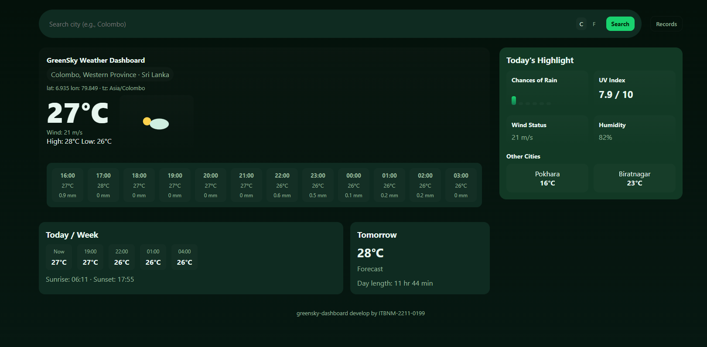
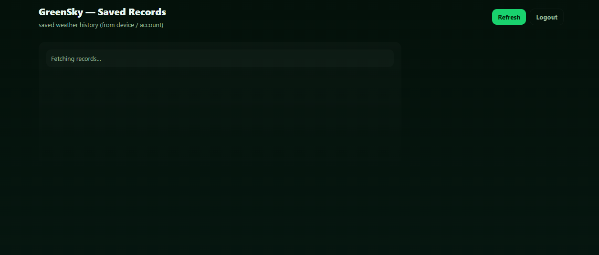
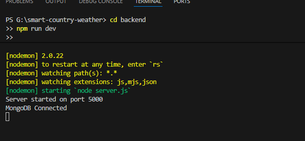

# **GreenSky – Simple Country & Weather Information System**

GreenSky is a simple web system that shows country and weather information using public APIs.
The system also sends the weather data to a backend server and saves it in MongoDB.
This project was created for the **Service-Oriented Computing Mini Project** at Horizon Campus.

---

## **📌 Features**

* Search weather by city
* Shows temperature, humidity, wind, and forecast
* Sunrise and sunset times
* User login (JWT)
* Saves weather data to the database
* View saved records in a records page
* API Key + JWT security
* Clean and modern UI

---

## **🛠 Technologies Used**

### **Frontend**

* HTML
* CSS
* JavaScript (Fetch / AJAX)

### **Backend**

* Node.js
* Express.js
* MongoDB (Mongoose)
* JSON Web Token (JWT)
* API Key Authentication

### **Public APIs**

* **Open-Meteo Geocoding API**
* **Open-Meteo Weather Forecast API**

---

## **📂 Project Structure**

```
smart-country-weather/
│
├── backend/
│   ├── middleware/
│   ├── models/
│   ├── routes/
│   ├── package.json
│   ├── server.js
│   └── .env (ignored)
│
├── frontend/
│   ├── greensky-dashboard.html
│   ├── login.html
│   ├── records.html
│
├── .gitignore
└── README.md
```

---

## **🚀 How to Run the Project**

### **1. Clone the Repository**

```
git clone https://github.com/Avishkawithanage/smart-country-weather
cd smart-country-weather
```

### **2. Start the Backend**

```
cd backend
npm install
npm run dev
```

### **3. Create `.env`**

```
PORT=5000
MONGO_URI=your_mongodb_connection
API_KEY=your_api_key
JWT_SECRET=your_jwt_secret

AUTH_USERNAME=your_username
AUTH_PASSWORD=your_password
```

### **4. Run Frontend**

Open these files in any browser:

* `frontend/login.html`
* `frontend/greensky-dashboard.html`
* `frontend/records.html`

---

## **📡 Backend API Endpoints**

### **POST /login**

Returns:

* JWT token
* API key

### **POST /submit**

Saves weather data (requires JWT + API key)

### **GET /records**

Returns saved weather history

---

## **🗄 Sample MongoDB Document**

```json
{
  "city": "Colombo",
  "temperature": 30,
  "humidity": 74,
  "wind": 4.5,
  "latitude": 6.90,
  "longitude": 79.95,
  "timestamp": "2025-01-01T12:00:00Z",
  "userId": "avii"
}
```

---

# 📸 **Screenshots**

### **1. Login Page**


### **2. Weather Dashboard**



### **3. Saved Records Page**



### **4. Backend Running**



---

## **👨‍🎓 Student Information**

**Name:** W. Thilan Avishka
**ID:** ITBNM-2211-0199
**Course:** BIT (Hons) Networking & Mobile Computing
**Module:** Service-Oriented Computing


